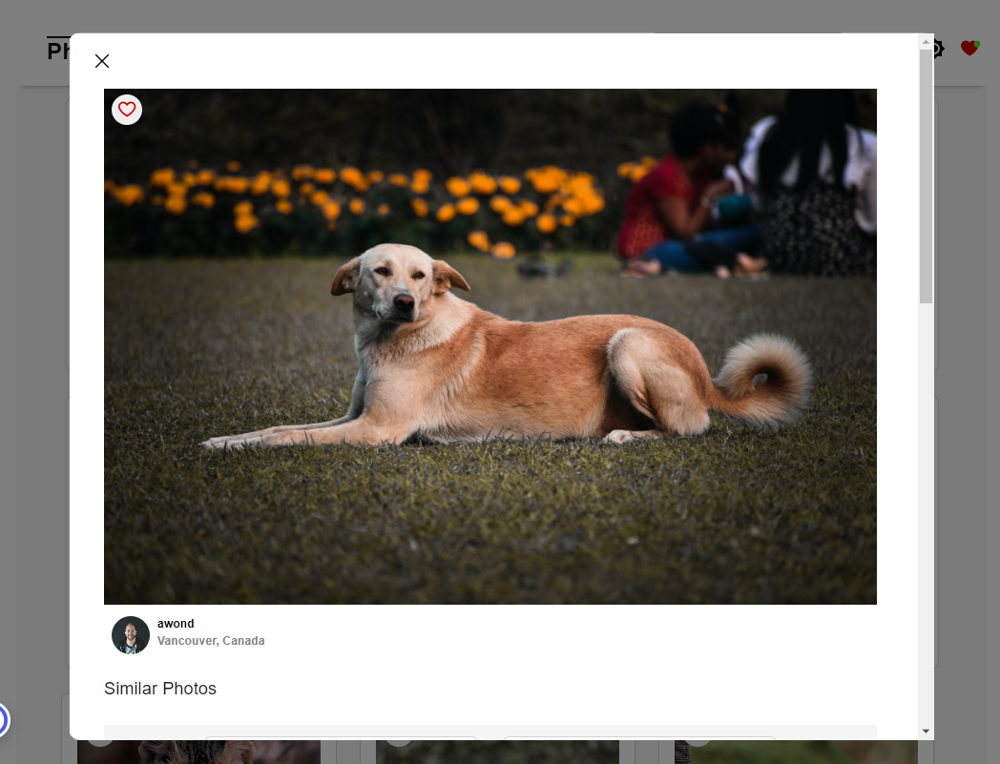
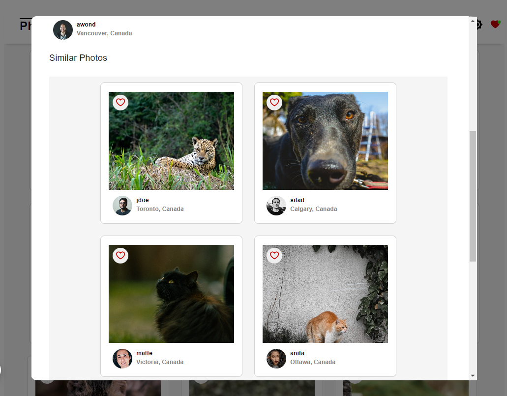
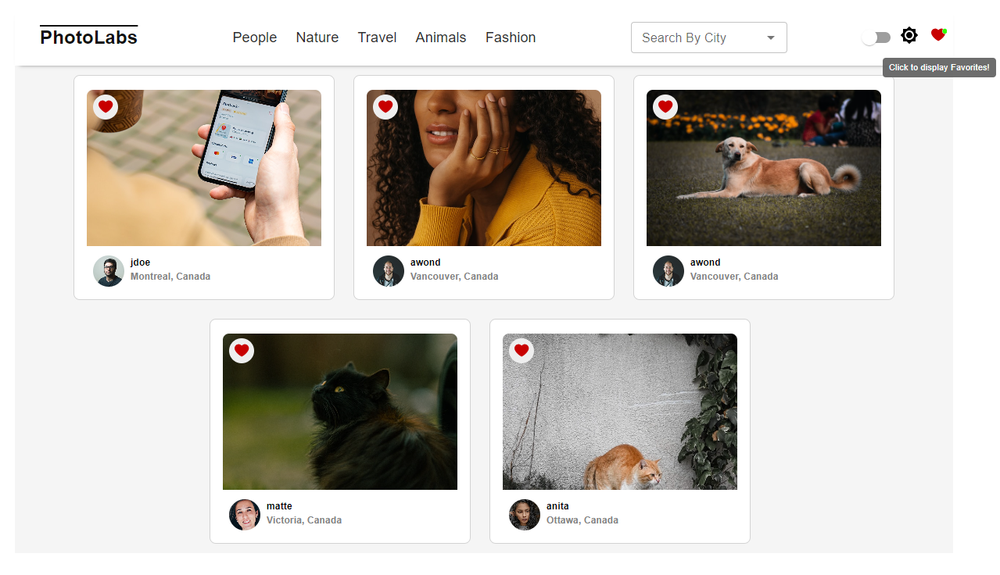
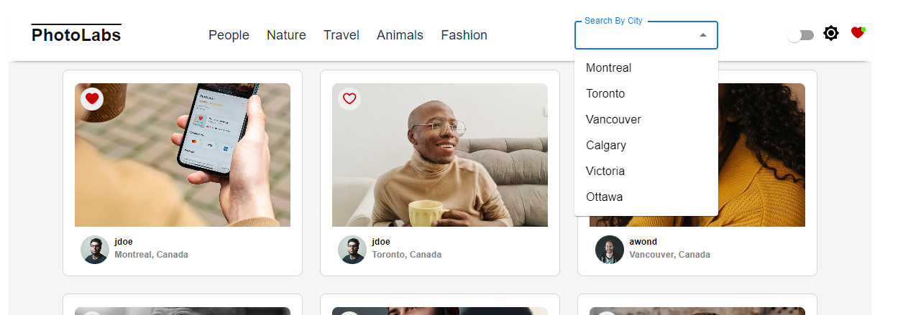
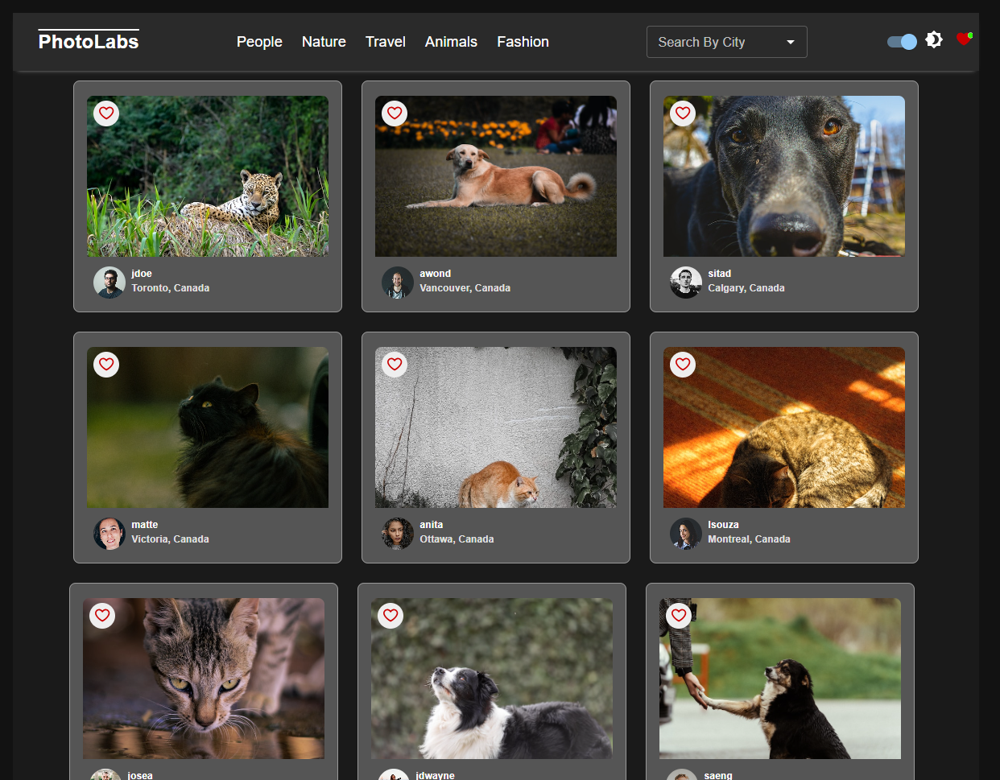

# Photolabs 🌇 🌉 🌄
This is a PhotoLabs project for the Web Development React course programming.

PhotoLabs is a React-based single-page application (SPA) that allows users to view photos in different contexts. A pre-existing API is utilized to build a frontend user experience for users to interact with photos.

## ✅ Features
- A user can view photos from the homepage loaded from the API.
- The user can navigate to different photo categories, also called topics.
- The user can like a photo from anywhere within the application where the photo is displayed.
- The user can click on a photo to view a larger version of the photo and relevant / similar photos.

### ⭐ Additional Features
- <b>Viewing Preferences</b>: Users toggle the dark mode switch on the navigation bar.
- <b>Favorites</b>: Users can view their list of favorite photos.
- <b>Search Bar</b>: Users can filter the photos by City.
<br>












## 🏆 Goals
To build a client-side application using the React view-layer library.

📌 <b>Back-end server setup:</b> 
- The data layer consists of PostgreSQL database.
- The API server consists of a Node Express.js server application.
- The server/persistence layer may require modifications for stretch goals.
## ✨ Getting Started

Install dependencies with `npm install` in each respective `/frontend` and `/backend`.

## [Frontend] Running Webpack Development Server

```sh
cd frontend
npm start
```

## [Backend] Running Backend Server

Read `backend/readme` for further setup details.

```sh
cd backend
npm start
```

## 🔧 Technical Specifications with API References
- <a href="https://reactjs.org/"> React</a>
- <a href="https://reactjs.org/docs/create-a-new-react-app.html#gatsby-focus-wrapper"> Create React App</a>
- <a href="https://webpack.js.org/"> Webpack</a>
- <a href="https://babeljs.io/"> Babel</a>
- <a href="https://expressjs.com/"> Express</a>
- <a href="https://sass-lang.com/documentation/"> Sass</a>
- <a href="https://mui.com/material-ui/"> Material UI (MUI)</a>
